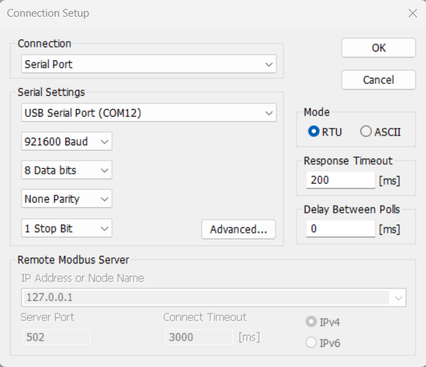
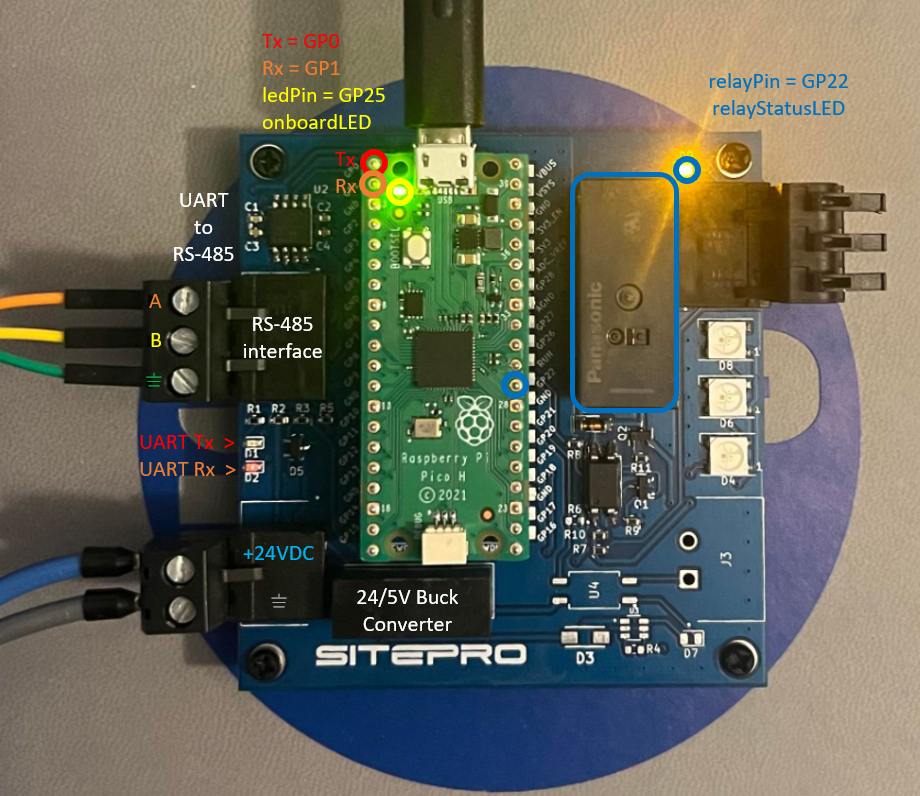
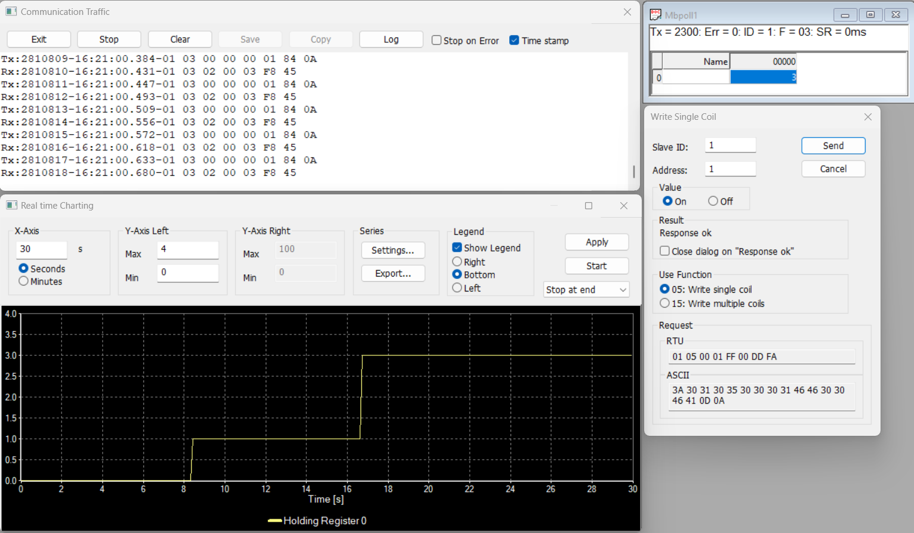

# FreeRTOS / Modbus RTU Master and Slave / Raspberry Pi Pico (RP2040)

Project: Modbus RTU slave running on UART port 0 at a baud rate of 921600.

This repository was inspired by the following repositories: 
    https://github.com/alejoseb/Modbus-STM32-HAL-FreeRTOS,
    https://github.com/smarmengol/Modbus-Master-Slave-for-Arduino,
    https://github.com/stephane/libmodbus/blob/master/src/modbus.c

also, it uses the port of FreeRTOS to the Raspberry Pi Pico published at: https://github.com/PicoCPP/RPI-pico-FreeRTOS.

The library supports any combination of master/slave instances.

## How to use it
- Install the Raspberry PI Pico C++ SDK according to the official [documentation](https://datasheets.raspberrypi.org/pico/getting-started-with-pico.pdf)
- Configure the environment to work with Visual Studio Code
- Clone this repository and initialize the submodules

```bash 
git clone https://github.com/j-broome/pico-freertos-modbus-io.git
cd pico-freertos-modbus-io
git submodule update --init --recursive

```
- Open the repository folder in Visual Studio Code
- update the [launch.json](https://github.com/j-broome/pico-freertos-modbus-io/blob/main/.vscode/launch.json) file according to your environment.
- Start the debugging session according to the official documentation 

## Modbus Slave Hardware Demo

The application bitwise ands bit 0 (onboardLED) and bit 1 (relayPin) of the least significant register to show functionality based on the register value set by Modbus Poll.

### Modbus Poll Setup



### Pico Expansion PCB 



PCB reference design or purchase: broome.jordan@protonmail.com

### Modbus Poll Utility



## Recommended Modbus Master and Slave testing tools for Windows

### Modbus master simulator: Modbus Poll

Windows:    https://www.modbustools.com/download.html

### Modbus slave simulator: Modbus Slave

Windows:    https://www.modbustools.com/download.html
